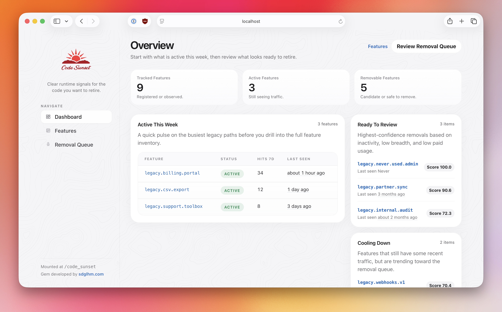

# code_sunset

[](https://github.com/sdglhm/code_sunset/actions/workflows/ci.yml)
[](https://rubygems.org/gems/code_sunset)
[](https://rubygems.org/gems/code_sunset)
[](https://github.com/sdglhm/code_sunset/blob/main/MIT-LICENSE)


`code_sunset` is a mountable Rails engine and gem for runtime-aware deprecation intelligence. It helps teams tag legacy code paths, observe real runtime usage, and decide what is safe to remove.



## Requirements

- Rails 7.1+
- PostgreSQL
- Active Job for async ingestion and scheduled maintenance work

## Installation

Add the gem:

```ruby
gem "code_sunset"
```

Install the initializer and migration:

```bash
bin/rails generate code_sunset:install
bin/rails db:migrate
```

If you want editable host-app copies of the dashboard UI from day one:

```bash
bin/rails generate code_sunset:install --eject-ui
```

Mount the engine:

```ruby
mount CodeSunset::Engine, at: "/code_sunset"
```

You can mount it anywhere:

```ruby
mount CodeSunset::Engine, at: "/ops/deprecations"
```

## API Examples

### `CodeSunset.hit`

```ruby
CodeSunset.hit("legacy.billing.portal", user_id: current_user.id, org_id: current_org.id)
```

### `CodeSunset.track`

```ruby
CodeSunset.track("legacy.csv.export", user_id: current_user.id, org_id: current_org.id) do
  Legacy::Exports::CsvRunner.new(current_account).call
end
```

### `CodeSunset.with_context`

```ruby
CodeSunset.with_context(
  user_id: current_user.id,
  org_id: current_org.id,
  request_id: request.request_id,
  metadata: { plan: current_org.plan_name }
) do
  CodeSunset.hit("legacy.reports.index")
  CodeSunset.hit("legacy.reports.download")
end
```

### `CodeSunset.register`

```ruby
CodeSunset.register(
  "legacy.billing.portal",
  owner: "billing",
  description: "Legacy self-serve billing flow kept for long-tail accounts.",
  sunset_after_days: 90,
  remove_after_days_unused: 60
)
```

## Production Configuration

```ruby
CodeSunset.configure do |config|
  config.enabled = true
  config.environment = Rails.env
  config.async = true
  config.sample_rate = 1.0
  config.app_version = ENV["CODE_SUNSET_APP_VERSION"] || ENV["APP_VERSION"] || ENV["GIT_SHA"]

  config.identity_fields = %i[user_id org_id]
  config.hash_identity = false
  config.event_retention_days = 90

  config.enqueue_failure_policy = :drop
  config.enqueue_buffer_size = 1000
  config.alert_cooldown = 24.hours

  config.dashboard_authorizer = ->(controller) do
    controller.respond_to?(:current_user) && controller.current_user&.admin?
  end

  config.plan_resolver = ->(org_id, metadata, _payload) { metadata[:plan] || Account.find_by(id: org_id)&.plan_name }
  config.internal_org_resolver = ->(org_id, _metadata, _payload) { InternalOrg.exists?(id: org_id) }
  config.paid_org_resolver = ->(org_id, _metadata, _payload) { Account.find_by(id: org_id)&.paid? }

  config.alert_webhook_url = ENV["CODE_SUNSET_WEBHOOK_URL"]
  config.slack_webhook_url = ENV["CODE_SUNSET_SLACK_WEBHOOK_URL"]
end
```

## Custom Metadata Filters

You can expose host-defined metadata filters across the dashboard, features index, feature detail page, and removal queue:

```ruby
CodeSunset.configure do |config|
  config.custom_filters = {
    region: { label: "Region", type: :string, metadata_key: "region" },
    beta_opt_in: { label: "Beta Opt-In", type: :boolean, metadata_key: "beta_opt_in" },
    account_tier: {
      label: "Account Tier",
      type: :select,
      metadata_key: "tier",
      options: [["Free", "free"], ["Pro", "pro"]]
    }
  }
end
```

Supported custom filter types:

- `string`
- `boolean`
- `select`

Each custom filter definition supports:

- `label`: user-facing label in the admin panel
- `type`: `:string`, `:boolean`, or `:select`
- `metadata_key`: the JSON key stored in `event.metadata`
- `options`: required for `:select`, as `[label, value]` pairs
- `placeholder`: optional text field placeholder for `:string`

## LLM Guide

If you want an AI coding assistant to understand how to install, instrument, interpret, and safely act on `code_sunset`, start with [llms.txt](llms.txt).

It covers:

- the public tracking API
- maintenance and retention semantics
- custom metadata filters
- the deterministic removal prompt workflow
- safety rules for using `code_sunset` as evidence during removal work

## Host App Responsibilities

### Ejecting and customizing the UI

To copy the engine layout, helper, views, and stylesheet into your app:

```bash
bin/rails generate code_sunset:eject_ui
```

This copies:

- `app/assets/javascripts/code_sunset/application.js`
- `app/assets/javascripts/code_sunset/vendor/chart.umd.min.js`
- `app/helpers/code_sunset/application_helper.rb`
- `app/views/layouts/code_sunset/application.html.erb`
- `app/views/code_sunset/dashboard/index.html.erb`
- `app/views/code_sunset/features/index.html.erb`
- `app/views/code_sunset/features/show.html.erb`
- `app/views/code_sunset/removal_candidates/index.html.erb`
- `app/assets/stylesheets/code_sunset/application.css`

Those host-app files override the engine UI automatically, so teams can restyle the mounted dashboard without forking the gem. They can also use the copied files as a starting point for a fully custom admin surface elsewhere in the host app.

### Dashboard authorization

The mounted engine is denied by default unless `config.dashboard_authorizer` returns truthy. The host app is responsible for deciding who can access `/code_sunset`.

### Recurring maintenance

Schedule these tasks in production:

```bash
bin/rails code_sunset:aggregate_rollups
bin/rails code_sunset:cleanup_events
bin/rails code_sunset:evaluate_alerts
```

If you opt into `config.enqueue_failure_policy = :memory_buffer`, also schedule:

```bash
bin/rails code_sunset:flush_buffer
```

### Retention behavior

Raw events are cleaned up after `event_retention_days`. Rollups remain the long-term source of truth for:

- unfiltered history
- date-range summaries
- environment-filtered history

Filters for `org_id`, `user_id`, `plan`, `paid_only`, and `exclude_internal` rely on retained raw events only. The dashboard will call this out when those filters are active.

Custom metadata filters also rely on retained raw events only. They are available everywhere in the admin panel, but they do not currently support long-range rollup-backed history.

## Enqueue Failure Policy

### `:drop`

Default and safest for request latency. If async enqueue fails, the event is logged and dropped.

### `:memory_buffer`

Best-effort mode for short queue outages. Failed events are stored in a bounded in-process buffer and must be flushed later by `code_sunset:flush_buffer`. This buffer is not durable across deploys or process restarts.

## Alerts

Alerts are evaluated in scheduled batches, not per event. `code_sunset` deduplicates repeated alerts for the same feature/status pair inside the configured `alert_cooldown` window.

Current alert destinations:

- Rails logger
- generic webhook
- Slack incoming webhook

## Dashboard Semantics

The dashboard mixes two analytics layers:

- Rollup-backed history for long-range feature activity and last-seen reporting
- Raw-event drill-down for recent event details, top users, top orgs, request paths, and raw-only filters

This keeps recent drill-down useful without forcing the gem to retain raw events forever.

## License

The gem is available as open source under the terms of the [MIT License](https://opensource.org/licenses/MIT).
